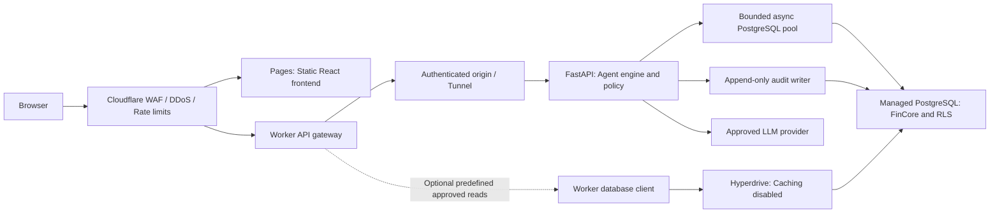

# SentinelSQL architectural audit and enterprise modernization

Date: 6 October 2026. Scope: the supplied deployment bundle, both engineering Markdown documents, the six-page English compiled PDF, BUSINESS_RULES.md, and recoverable historical test sources in the parent Git repository. This is an architecture proposal and audit; application code, database data, and deployments have not been changed.

## Executive recommendation

Preserve the separated Python agent interfaces and the inspectable validation/retry pipeline. Modernize around a static React frontend on Cloudflare Pages, a Cloudflare Worker gateway, a regional containerized FastAPI engine, and managed PostgreSQL with a synthetic FinCore banking dataset. Establish fail-closed authorization and a reproducible test baseline before presenting the product as ready for financial institutions.

The existing platform is a promising governed text-to-SQL prototype. Its production security assurances exceed the controls currently implemented. Deterministic routing through stages does not make model classification, generated SQL, financial meaning, or data confidentiality deterministic. The defensible product claim is that every permitted execution crosses independently enforced, versioned policy checks.

Chinook is useful for testing joins and sales aggregations, but it does not exercise joint account ownership, transaction reversals, multicurrency ledgers, branch restrictions, KYC evidence, investigation assignments, or audited financial definitions. FinCore introduces realistic governance and meaningful security demonstrations for bank buyers. A banking schema alone does not establish regulatory compliance or turn this analytics gateway into a transactional core banking system.

## 1. Repository findings and evidence

### Strengths to preserve

- Agents have distinct responsibilities and typed dataclasses: routing, schema discovery, synthesis, Guardian validation, runtime interpretation, and orchestration. This supports an API adapter without an immediate engine rewrite.
- The normal parser-backed path rejects stacked statements, restricts query roots, checks base-table names against role scopes, and passes the Guardian's rendered SQL to the Critic.
- Schema discovery starts from authorized tables, and schema cards include column metadata, relationships, and grounded values. This is a useful basis for a stronger closed-world catalog.
- Retries are bounded; events, failed/corrected SQL, diffs, and result metadata are already represented as structured objects.
- SQL generation is separate from execution. The runtime narrative is currently calculated from the returned dataframe rather than asking another model to invent a narrative.
- The UI already exposes results, SQL, charts, and telemetry. Preserve the visibility, but replace assertions with evidence from actual validation decisions.

### Material findings

| Priority | Finding and evidence | Implication and required change |
|---|---|---|
| Critical | `agents/guardian.py:223-257` accepts a heuristic fallback when SQLGlot cannot import. That fallback does not enforce table authorization, statement count, or SELECT roots. `agents/critic.py:57-66` also skips grounding when parsing is unavailable or fails. | Parser failure must stop execution. Require parser readiness and pin a tested version. Never downgrade an authorization boundary to regex. |
| Critical | `core/auth.py:25-62` has public plaintext evaluation identities. `app.py:262-282` prefills/displays credentials. `agents/orchestrator.py:98-99` permits missing identity and consequently an unrestricted table scope. | Use production SSO/MFA and server-resolved entitlements. The API must require an authenticated principal before invoking the engine; no public system-mode execution. |
| High | `agents/guardian.py:158-174` authorizes `Table.name`, losing database/schema qualification. CTE names are removed globally. `core/database.py:168-172,226-230` also introspects unqualified table names. | Resolve schema-qualified physical relations within each lexical query scope. Do not authorize a same-named table in another schema/catalog or globally exempt a CTE name. |
| High | `agents/critic.py:97-119` unions all referenced-table column names and globally exempts aliases. Empty metadata skips column checks. | Bind each column to its actual relation/alias, resolve derived-table and CTE output schemas, handle ambiguity and wildcards explicitly, and reject missing catalog metadata. |
| High | `agents/guardian.py:125-128` does not explicitly block SELECT INTO; lines 139-155 accept suspicious joins if any WHERE exists; lines 202-209 treat any nested LIMIT/OFFSET as a sufficient cap and do not clamp an oversized existing TOP. | Explicitly reject mutating SELECT forms and unsafe functions. Validate joins per scope and enforce a capped outer result limit plus workload limits. Parser-backed exploit cases remain to be tested with the pinned parser. |
| High | `core/database.py:367-372` stops waiting on a thread but leaves the database query running. Database connections are not independently proven read-only by the application. | Add database statement/lock timeouts, driver cancellation, bounded pools, read-only transactions, and restricted database principals. A thread is not an execution sandbox. |
| High | `agents/critic.py:187-205` treats empty results as a reason to relax filters. `agents/coder.py:213-220` can substitute the first grounded country; broad fallback templates may answer a different question. | A valid empty set is success. Preserve the requested entity and predicates. Return explicit unavailability on model failure rather than inventing a fallback answer. |
| High | The UI claims row-level control (`app.py:350`) although implemented scopes are table-level. Neither column masking nor tenant/branch/case enforcement is present. | Enforce object, column, row, and output policies in both application and database layers. |
| High | `core/vanna_client.py:24-58,115-131,205-211` uses a shared disk JSON store; examples lack tenant/role partitioning. Reconnaissance samples raw text values into model context and events. | Partition retrieval and caches by tenant, active persona, schema, and policy version. Restrict grounding to safe reference values. Exclude customer PII from prompts and ordinary telemetry. |
| Medium | `core/database.py:80-102` automatically switches to SQLite after a live connection failure. `core/config.py:63-64` defaults to trusting server certificates and optional encryption. | Require an explicitly selected demo mode. Production must fail unavailable and verify TLS certificates. |
| Medium | `app.py:585-595` derives firewall/grounding assertions from overall success, uses candidate tables as referenced tables, and unconditionally labels CWA enforced. | Record actual per-stage outcomes, resolved relations/columns, normalized SQL hash, schema/policy versions, and result provenance. Execution success is not a proof of semantic correctness. |

The API must correct unsafe behavior while preserving safe public interfaces. Backward compatibility does not require retaining a fail-open parser fallback or broadening a user's filters.

### Documentation and test reconciliation

The EN/AR documents and English PDF describe an asynchronous enterprise architecture. The actual controller is a synchronous sequential loop. The agent count is a presentation grouping: router, explorer, coder, Guardian, and Critic are separate stages; the visualizer follows execution.

Both documentation forms report 44 passing tests. No test files are present in the supplied bundle or the immediate parent working tree. Eight historical test files are recoverable from Git and contain exactly 44 test methods; their module list differs from the documentation's test table. There is no standalone `hallucination_detector.py` in this bundle: grounding is implemented inside the Critic.

Audit verification: 16 historical authentication/Guardian tests were executed against the current bundle in memory without database or provider calls. Thirteen passed; three failed: `test_detects_cartesian_product`, `test_enforces_rbac_table_authorization`, and `test_security_violation_exception_raised`. The available audit Python lacks SQLGlot, so those failures expose the unsafe fallback. `requirements.txt` does declare SQLGlot; this result is not evidence that the deployed server lacks it. The full 44-test pass claim remains unverified in the current environment.

Additional in-memory probes confirmed that the missing-parser path accepts unauthorized table access, stacked SELECTs, a non-SELECT transaction statement, and SELECT INTO. A fake-database Critic probe confirmed skipped grounding can reach execution. No unsafe SQL was sent to an actual database.

First gate: recover the full historical suite into the modern project, install a locked supported environment in CI, reproduce all 44 tests with no skips, and add parser-absent/metadata-unavailable denial cases.

## 2. Pillar A: FinCore enterprise banking domain

### Schema conventions

Use normalized PostgreSQL relations in `banking`, `ledger`, `credit`, `compliance`, `vault`, `policy`, and `audit` schemas. The role-visible query catalog consists of approved views in separate reporting schemas. Schema cards describe those views and approved joins; the current base-table-only introspector must be extended accordingly.

For tenant-owned relations, use a composite primary key `(tenant_id, id)` and composite foreign keys containing `tenant_id`. Add `legal_entity_id` where it defines accounting or jurisdiction boundaries, and enforce the legal entity's tenant ownership. This prevents a foreign key from linking one tenant's transaction to another tenant's account.

Use UTC `timestamptz` for event timestamps, `date` for contractual value/business dates, explicit branch calendars/timezones, and reference currencies with minor-unit definitions. Use `numeric(20,4)` or greater precision for amounts and higher precision for rates/intermediate accruals; never binary floating point for monetary arithmetic. Define rounding per product/currency and metric, not per visualization.

| Relations | Essential fields and relationships |
|---|---|
| `tenants`, `legal_entities`, `branches` | Tenant identity; legal entity jurisdiction/base currency; branch entity, code, calendar, and timezone. Branch code unique within entity. |
| `currencies`, `business_calendars` | ISO currency code/minor units; business days, holidays, cutoff rules. Global reference data. |
| `customers`, `customer_private`, `customer_relationships` | Public/internal party identifier and party type; separate encrypted names/contact/government identifiers; effective-dated beneficial-owner/organization links. Private data lives in `vault`. |
| `account_products`, `accounts`, `account_holders` | Product, branch, currency, status/open-close dates, ledger account; account/customer many-to-many relationship with holder role and effective dates. No comma-separated owners. |
| `account_rate_periods` | Account/product, effective interval, rate, day-count convention, policy version. Enforce non-overlapping effective intervals. |
| `transactions`, `transaction_events` | Payment instruction ID, idempotency/source reference, source/destination account where applicable, instruction amount/currency, channel, business/value date, booked time, state, reversal link, tokenized counterparty. Append state-transition events. Instruction totals are distinct from ledger balances. |
| `fx_rate_quotes`, `transaction_fx_legs` | Source/quote currencies, exact rate, provider, quote/effective timestamps, policy reference; transaction leg, amount/currency, and selected quote. Preserve the rate actually used and balance each currency through explicit FX clearing accounts. |
| `ledger_accounts`, `journal_entries`, `journal_lines` | Ledger account currency/entity and optional customer-account link; posting batch linked to transaction; line sequence, debit/credit side, positive amount, currency, ledger account. Each posted journal balances by currency; currency/entity must match the posting account. |
| `account_balance_snapshots` | Account, as-of booking sequence/time, ledger balance, available balance, currency, calculation version. A derived read model reconciled to posted lines and holds. |
| `account_holds` | Account, amount/currency, reason, start/expiry/release state, linked transaction. Available balance derives from cleared ledger and active holds under a documented product convention. |
| `loans`, `loan_borrowers` | Product/servicing account, original principal, currency, origination/maturity/status; borrower/guarantor relationships. |
| `loan_rate_periods`, `loan_schedule_items`, `loan_payment_allocations`, `interest_accruals` | Effective rates/day count; installment due dates and principal/interest; allocation of settled payment to schedule items; accrual period, amount, rule version, and posting link. Payments must not be double-counted. |
| `cards`, `card_authorizations` | Issuer/provider token, last four digits, expiry, status/account link; authorization event, merchant token, amount/currency, decision, and settlement transaction. No CVV or full PAN in analytics storage. |
| `kyc_reviews`, `kyc_document_refs`, `screening_hits` | Customer, review status, effective/expiry dates, evidence reference, source/list version, disposition, reviewer. Documents remain in restricted storage; reference is not a public download URL. |
| `compliance_cases`, `case_subjects`, `case_assignments`, `risk_assessments` | Case type/status/severity, customers/transactions involved, investigator assignments/effective dates; versioned risk features, scores, provenance, as-of date, and review outcome. |
| `rule_sets`, `rule_parameters`, `metric_definitions` | Approved effective-dated rule/version, jurisdiction/product scope, thresholds/day count/rounding, and finite metric definitions with authorized dimensions and joins. |
| `query_audit_events` | Query/event IDs, tenant/subject/active persona, policy/schema/model versions, normalized SQL/parameter hashes, object/column resolution, verdict codes, retries, duration, rows/bytes, outcome, redacted `jsonb` evidence. Separate append-only writer. |

The ledger invariant spans multiple rows: enforce it at the atomic posting boundary with a deferred constraint trigger or controlled posting service, not a row CHECK that cannot examine sibling lines. Posted entries are immutable; reversals add compensating journals. The text-to-SQL execution role never posts entries or changes accounts. Add unique constraints for source/idempotency references and journal line sequences, state/currency checks, and tenant/account/time indexes. Partition large transaction and audit relations by date only after measured volume justifies it.

JSONB provides flexible evidence fields, not immutability by itself. Protect the audit writer, prohibit updates/deletes through ordinary roles, sign exported batches, and use independent retention storage with an explicitly chosen retention policy.

### Strict RBAC matrix

Non-overlap means the authorized schema-qualified query objects are disjoint. Distinct masked views may legitimately derive from the same banking facts. Hard-partitioning all underlying banking tables by job role would prevent legitimate workflows.

| Active persona | Exclusive visible objects | Row scope | Explicit denials |
|---|---|---|---|
| `compliance_officer` | `reporting_compliance.kyc_reviews`, `.screening_dispositions`, `.aml_cases`, `.customer_risk` | Tenant, authorized jurisdiction/entity, compliance assignment | Branch transaction workspace, fraud device evidence, raw card data, unrestricted private identifiers/documents. |
| `branch_analyst` | `reporting_branch.account_summary`, `.daily_flows`, `.loan_performance`, `.product_metrics` | Tenant and assigned branches; approved customer-account subset | KYC documents, AML/SAR narratives, fraud evidence, other branches, all raw base relations. |
| `fraud_investigator` | `reporting_fraud.assigned_cases`, `.transaction_features`, `.card_events`, `.counterparty_features` | Tenant and active case assignment, approved investigation window | Branch commercial views, complete KYC documents, PAN/CVV, unassigned cases, raw identities. |
| `audit_reader` | `reporting_audit.query_decisions`, `.policy_changes`, `.access_reviews` | Tenant and delegated audit mandate | Customer financial rows, KYC evidence, full prompts/results, write privileges. |

All personas deny `banking.*`, `ledger.*`, `credit.*`, `compliance.*`, `vault.*`, and every other persona's reporting schema. A separate tightly controlled evidence-access service handles exceptional identity disclosure; generic SQL queries cannot request it.

Production identity resolves exactly one active persona from approved server-side entitlements; users cannot supply allowlists, tenant IDs, branch lists, or arbitrary roles. Conflicting duties cannot be combined through a union of table permissions. Demo role selection changes a synthetic persona only.

Enforce this with database grants, safe view ownership, column projection/tokenization, and tenant/branch/case RLS. Use execution principals that are not superusers, relation owners, or `BYPASSRLS`; enforce RLS on base relations and set claim-derived context within each transaction. Apply the same policies to introspection, grounding, queries, results, exports, and telemetry. PostgreSQL documents the owner/bypass exceptions. [PostgreSQL RLS](https://www.postgresql.org/docs/current/ddl-rowsecurity.html)

View design requires a tested permission model: `security_invoker=true` requires the caller to have underlying relation privileges, so it cannot simply be combined with a grants-on-views-only policy. For this model, use restricted view owners with appropriate forced base-table RLS and security-barrier views, then test effective permissions and row filtering end-to-end. [PostgreSQL CREATE VIEW](https://www.postgresql.org/docs/current/sql-createview.html)

### Financial rule catalog

| Rule | Deterministic definition and boundaries |
|---|---|
| Ledger balance | Sum posted debit/credit lines according to account normal balance at an explicit as-of point; exclude pending instructions. Treat reversal lines consistently. Reconcile snapshots. |
| Cash-monitoring threshold | Aggregate cash-in and cash-out separately by subject, institution, jurisdiction, and business day. Use effective-dated policy thresholds and FX rules; do not net opposite directions or count both sides of a transfer twice. |
| Structuring/velocity alert | Approved rule combining a rolling window, count, threshold bands, account/beneficial-owner grouping, and cash/channel classification. An alert is an investigative signal, not a finding of wrongdoing. |
| Interest accrual | Sum principal outstanding for each effective rate segment multiplied by its annual rate and contractual day-count fraction. Apply documented rounding and payment/value-date conventions. No universal fixed divisor or invented rate. |
| Loan delinquency | Unpaid due amount after approved payment allocations and grace rules; days past due measured from the earliest remaining unpaid due date as of a specified business date. |
| Risk score | Versioned, approved feature weights and bounded score with stored feature provenance. Threshold-to-band mapping is a business policy; missing features cannot be fabricated. |
| Illustrative expected loss | `PD × LGD × EAD` with consistent horizon and currency. Label it an approved analytics model, not an assertion of IFRS 9 compliance. |

As a jurisdiction-specific example, U.S. FinCEN CTR guidance describes cash transactions aggregating to more than USD 10,000 in one business day by/on behalf of the same person. This is not a universal threshold for all transfers, jurisdictions, or AML monitoring. [FinCEN CTR guidance](https://www.fincen.gov/resources/frequently-asked-questions-regarding-fincen-currency-transaction-report-ctr)

Replace repeated prompt formulas with one versioned metric/rule registry and approved views/calculation functions. Coder output should identify approved metrics, dimensions, and filters; deterministic compilation generates financial expressions from that catalog. SQL that is syntactically safe can still contain incorrect arithmetic, joins, or financial assumptions. A schema-only AST firewall cannot establish business accuracy.

### Guardian and closed-world defense

1. Authenticate and derive tenant, active persona, branch/case scopes, and policy version before retrieval.
2. Publish only the authorized views, projected columns, approved relationships/functions, metrics, and safe reference enums into the schema card. No raw customer samples.
3. Parse exactly one statement in the selected dialect; fail closed on missing parser, unknown AST form, empty catalog, unsupported function, or binding ambiguity.
4. Resolve physical relations, CTEs, subqueries, and every column within lexical scopes. Validate fully qualified catalog/schema/object identity, output columns, sanctioned joins, and metric definitions.
5. Deny DDL/DML, SELECT INTO, COPY, locks/administrative statements, writable CTEs, external access, unsafe functions, and unapproved system schemas. SELECT alone is insufficient because function calls can have side effects.
6. Apply a capped outer row limit, row/byte budgets, bounded date ranges for high-volume datasets, and database timeouts. A result limit does not bound aggregation work.
7. Execute the exact approved SQL/parameters through a restricted principal in a read-only transaction. Revalidate every corrected candidate. Keep policy/schema fingerprints tied to execution.
8. Apply result/aggregate/export policy and persist actual verdict evidence. Suppression for small cohorts can reduce simple disclosure but is not a proof against repeated-query inference.

Example decisions:

| Attempt | Expected independent protection |
|---|---|
| Branch analyst asks for national IDs | Attribute absent from role catalog; Guardian rejects projected column; view/database privileges prevent raw-vault access. |
| Branch analyst references `reporting_compliance.aml_cases` | Fully qualified namespace denial before execution; database grant denial. |
| Coder invents `banking.hidden_wire_transfers` | Closed-world unknown relation; no guessed execution. |
| Nested CTE/UNION joins an unauthorized relation | Scope-aware binder inspects every physical relation, without global CTE-name exemptions. |
| User says to ignore role restrictions | Router may classify attack; authorization remains effective even if classification misses it. |
| LLM changes the tenant/branch predicate or returns zero rows | Server RLS and frozen query intent preserve scope; valid empty results complete successfully. |

Seed FinCore with reproducible synthetic scenarios: two or more tenants, different branch assignments, joint accounts, matched debit/credit journals, returns/reversals, cash threshold boundaries, leap-day accrual, multiple currencies, overdue loans, case assignments, and adversarial query prompts. Preserve Chinook as a legacy regression fixture; do not reinterpret music customers/invoices as actual banking records.

## 3. Pillar B: decoupled product experience

### Why replace the current UI

`app.py` combines branding/CSS, authentication, session configuration, database health probing, agent orchestration, charts, dataframe storage, telemetry, exports, and feedback. It constructs resources on script reruns and repeats a live database connection check from the sidebar. Session history retains dataframes/figures; this increases memory pressure and ties the interaction to one server session.

Streamlit can serve useful multiuser internal applications. For this product, independent client rendering, durable jobs, stateless API scaling, precise responsive layouts, URL-addressable workspaces, and a controlled component system are difficult to establish in the current monolith. CSS targets framework DOM internals, and branding still says AegisSQL despite SentinelSQL documentation. The data table is not evidence that Streamlit itself lacks virtualization; the actual gap is the full-dataframe API/memory model and limited control over the desired grid workflow.

### Landing page specification

- Use obsidian/slate foundations (`#090D14`, `#111827`), subtle borders (`#263244`), off-white foreground (`#F8FAFC`), cyan technical accents, and restrained green/red status colors. Use high-contrast typography, tabular numerals, monospace telemetry, Lucide icons, and zero emojis.
- Hero: “Ask financial questions. Inspect every SQL decision.” Show the NL question, a masked FinCore result, and a real policy verdict. Primary action opens the synthetic security simulator; secondary action requests an enterprise evaluation.
- Security simulator: canned attack and hallucinated-table scenarios plus bounded synthetic queries. Animate actual validation stages and AST nodes using SVG. Display validator/schema/policy version and actual decision codes. Run in an isolated synthetic environment with no production data or credentials.
- Architecture visualizer: interactive identity → catalog → coder → Guardian → execution → audit graph, with keyboard-accessible node details and reduced-motion support.
- Role portal: separate compliance, branch, fraud, and audit demo workspaces showing permitted data and blocked boundaries. Production role selection is restricted to existing identity entitlements.
- Proof content: real benchmark methodology, deployment options, policy examples, and verified integration claims. Do not invent customer logos, certifications, latency statistics, or absolute claims about eliminating hallucinations.

### Analytics workspace specification

Use React/TypeScript with Vite on Pages as the lowest-complexity static frontend. Tailwind, Radix/shadcn components, and Lucide provide the requested visual/control foundation. Use a virtualized table with server-side pagination, a code editor for SQL/AST inspection, and financial charts driven by approved metric metadata.

| Panel | Behavior |
|---|---|
| Schema Explorer | Server-filtered views, columns, relationships, descriptions, currency/unit metadata. Never ship a full catalog to the browser and hide forbidden objects with CSS. |
| Natural Language SQL Studio | Question, scope/as-of controls, approved metric selection, intent/result status, exact validated SQL, parameter metadata, and bounded repair trace. No browser execution authority for edited arbitrary SQL. |
| Data Grid | Cursor pages from a bounded query snapshot, virtual rendering, typed numeric/date fields, masking, truncation indication, and permission-checked export. |
| Financial BI | Balance/flow/loan-risk metrics with currency, as-of time, aggregation grain, rule version, and replica lag. Do not silently sum different currencies or an incomplete result page. |
| AST Telemetry Inspector | Actual allowed/denied decision, resolved objects/columns, policy/schema versions, stage durations, query hash, retries, and redacted evidence. |

Financial decimals travel as strings or explicit decimal types; browser formatting must not change calculation precision. Escape displayed database content, neutralize spreadsheet formula cells in exports, support keyboard navigation and English/Arabic RTL, and distinguish an empty result from denial, timeout, or provider failure.

## 4. Pillar C: Cloudflare topology and PostgreSQL migration

### Preferred deployment

The user's backend options are complementary: a containerized Python origin provides compute; a Worker gateway fronts it with centralized request controls. Use the direct proxied/Tunnel origin route first if needed for an early API pilot, then introduce the Worker without rewriting the engine.

Place FastAPI and PostgreSQL near each other in the institution's approved region; use a read replica for analytics only when lag/as-of semantics are explicit. Static Pages assets can benefit from global caching/compression without application compute startup. That does not remove Python startup, database RTT, or model latency.

Pages supports React builds and static Next.js exports. For full-stack Next.js server rendering, current Cloudflare guidance recommends vinext on Workers; the Pages requirement therefore favors a SPA/static export. [React on Pages](https://developers.cloudflare.com/pages/framework-guides/deploy-a-react-site/), [Next.js on Pages](https://developers.cloudflare.com/pages/framework-guides/nextjs/)

FastAPI is supported in Python Workers, so it is incorrect to declare it categorically impossible. However, this repository's native ODBC assumptions, thread-based runtime, dataframe-heavy results, and local filesystem persistence require adaptation. Keep the engine in a container initially; benchmark a Workers-compatible Python variant later. [FastAPI on Python Workers](https://developers.cloudflare.com/workers/languages/python/packages/fastapi/), [Python package support](https://developers.cloudflare.com/workers/languages/python/packages/)

Provider choice should follow region availability, private connectivity, database proximity, health/rollback controls, support requirements, and measured cost. Evaluate a managed container runner and managed database for the first production pilot; a VPS demands operational ownership of patching, backups, and high availability. Do not select a banking hosting provider from a generic price comparison.

### Hyperdrive boundary

Hyperdrive supports PostgreSQL/MySQL and currently does not support SQL Server. It is a Worker database binding; forwarding HTTP to FastAPI does not pool the container's PostgreSQL connections. [Supported databases](https://developers.cloudflare.com/hyperdrive/reference/supported-databases-and-features/)

The primary path above uses an ordinary bounded async PostgreSQL pool, optionally PgBouncer. The dashed path uses Hyperdrive only for a separately authorized Worker database client. Do not draw `FastAPI → Hyperdrive` as if Hyperdrive were a standard hosted endpoint for external Python containers.

If later measurements justify routing generated queries through Hyperdrive, add an internal execution Worker. FastAPI sends a short-lived integrity-protected plan binding the exact SQL/parameter hashes, subject/tenant/persona, policy/schema versions, request ID, audience, and expiry. That Worker accepts no browser-supplied SQL, applies the required transaction scope, executes once, and returns results to the Critic. Validate replay policy, transaction context, schema/policy freshness, data residency, and added RTT before promotion.

Disable Hyperdrive result caching initially for banking/auth/permissions/audit reads. Pooling still works with caching disabled. Enable caches later only for explicitly approved aggregates with measured freshness and tenant isolation. Hyperdrive transaction pooling resets connection state, so test RLS claim context inside each explicit transaction rather than relying on persistent session settings. [Query caching](https://developers.cloudflare.com/hyperdrive/concepts/query-caching/), [Connection pooling](https://developers.cloudflare.com/hyperdrive/concepts/connection-pooling/)

PostgreSQL is attractive independently of Hyperdrive: native RLS, robust exact numeric types, JSONB evidence, async drivers, and flexible partitioning/read-model options. Migration is still an engineering project: identifiers, TOP/LIMIT, casts, date functions, introspection, driver behavior, decimal conversion, and collation differ. No general automatic transpiler can guarantee semantic equivalence of every T-SQL query.

### Edge and deployment controls

- Cloudflare managed WAF/DDoS protection and route/IP rate limits; application user/tenant/token/concurrency budgets alongside them.
- Gateway token verification and independent API identity verification. Reject origin bypass; use authenticated Tunnel ingress or verified TLS with restricted inbound access. Strip untrusted forwarded identity headers. Tunnel supplies connectivity, not user authorization.
- Authenticated query/result/telemetry responses use `Cache-Control: no-store`; only approved public assets are CDN-cached. Apply restrictive CORS, browser security headers, cookie/CSRF controls, and secret rotation.
- Keep PII out of ordinary gateway/provider logs. Decide permitted edge processing, database region, model-provider retention, and backup locations before a production banking pilot.

A unified GitHub Actions pipeline runs backend legacy/security/PostgreSQL integration tests and frontend type/build/accessibility checks; builds/scans a multi-stage container; publishes an immutable image; deploys backend, Pages, and Worker to staging; runs API/policy/end-to-end checks; then promotes tested versions. Use expand/contract schema migrations and reversible traffic routing. Build database migrations with separate privileged credentials, never the query role. [Pages CI upload](https://developers.cloudflare.com/pages/how-to/use-direct-upload-with-continuous-integration/), [Workers external CI](https://developers.cloudflare.com/workers/ci-cd/external-cicd/)

## 5. Pillar D: compatible API and production engine

### API contracts

| Endpoint | Contract |
|---|---|
| `POST /api/v1/auth/login` | Production identity exchange through OIDC/SSO and existing MFA; return a short-lived session token/cookie and approved active persona. Restrict password-based demo login to synthetic environments. Never trust a role allowlist from the request. |
| `POST /api/v1/query/classify` | Return exactly HELP, OUT_OF_SCOPE, SECURITY_ATTACK, or DATA_QUERY with confidence and role-specific onboarding. No SQL execution. Model unavailability is explicit; classification is not authorization. |
| `POST /api/v1/query/execute` | Accept question and allowed filters, not arbitrary executable SQL. Resolve identity and reclassify/revalidate server-side. Return `202` and an opaque query ID for asynchronous work with an idempotency key. |
| `GET /api/v1/queries/{id}` | Authorized owner/tenant status, outcome, and provenance; distinguish denial, grounding error, timeout, provider failure, and success with zero rows. |
| `GET /api/v1/queries/{id}/results` | Bounded typed rows, result-snapshot cursor, decimal/currency metadata, row/byte limits, truncation and as-of indicators. |
| `WS /api/v1/queries/{id}/events` | Authenticated owner/tenant stream, monotonic event IDs, reconnect/replay, bounded queues and backpressure. Validate Origin and token expiry; avoid secrets in URL parameters. |
| `GET /api/v1/telemetry/audit-logs` | Audit-specific permission, tenant/mandate filters, cursor pagination, redacted validation evidence and stage latency. |

Keep existing dataclasses and safe method signatures behind a `LegacyEngineAdapter`. Explicitly map dataframes into typed JSON; maintain `IntentResult` property aliases and intent aliases. Match old authorized success/rejection contracts before frontend replacement. Keep the MSSQL adapter and default T-SQL behavior for regression fixtures; add a separate PostgreSQL adapter and a versioned dialect policy.

Wrapping the synchronous controller in `async def` does not make its work asynchronous. First run it through a bounded worker executor with admission control and a thread-safe event bridge. Then migrate provider/database I/O to genuine async implementations. Keep stages ordered: draft → audit → execution. [FastAPI concurrency](https://fastapi.tiangolo.com/async/)

### State machine and resource policy

`RECEIVED → AUTHORIZED → CLASSIFIED → GROUNDED → DRAFTED → VALIDATED → EXECUTING → SUCCEEDED`

HELP completes without SQL. Security or permission violations end in DENIED. Parser/metadata/provider outages end in FAILED. Only repairable syntax/known-catalog errors enter a bounded redraft loop; every draft is re-audited. Zero rows are a valid successful outcome. TIMEOUT and CANCELLED must cancel database work and release resources.

Persist query state and redacted events so reconnecting clients and multiple API replicas can recover status. Use an appropriate durable job queue when accepted jobs must survive API restarts; an in-process background task is insufficient for that guarantee. Limit total attempts, elapsed time, tokens, concurrency, pool connections, result rows/bytes, and exports. Users may reduce a row limit but cannot increase the server's security ceilings.

Database cancellation must be real: use read-only transactions, `statement_timeout`, `lock_timeout`, driver cancellation, and connection cleanup on request/job cancellation. Maintain a connection budget across API replicas and any Hyperdrive bindings. [PostgreSQL connection defaults](https://www.postgresql.org/docs/current/runtime-config-client.html)

Financial narratives should use approved metric metadata. The current Critic chooses the first numeric column, which can be an identifier; preserve the interface while changing selection to semantic measures. Charts/narratives are not financial evidence unless their source, metric version, currency, grain, and as-of time are explicit.

### Disk and dependency plan

An initial parallel-agent startup failed with a disk-space error. A subsequent read-only drive measurement reported approximately 2.4 GB available on C: and 119 GB on D:. Treat those as an audit-time snapshot. No data or cache directories were deleted.

The supplied requirements are already small and do not declare Vanna/ChromaDB. Avoid assuming those optional imports caused the pressure. Move project-local environments, build/wheel caches, and synthetic datasets to D: or CI. Preserve repository history, Codex state, and needed environments; inventory owner/path/size before removing a specific reproducible cache.

Split dependencies into legacy UI/MSSQL, engine/API, export, and development profiles. Keep Streamlit/Plotly/ODBC only where legacy compatibility requires them; the PostgreSQL API runtime can eventually exclude them. Retain dataframe/decimal compatibility until tests prove replacement safe. Build wheels in a multi-stage Docker builder and copy only required runtime artifacts into a slim non-root image. Exclude `.venv`, local datasets, caches, secrets, and Git metadata from the build context. Use locked dependencies and run expensive builds/security scans in CI. [Docker multi-stage builds](https://docs.docker.com/build/building/multi-stage/)

## 6. Phased implementation roadmap

Indicative sequence for a small cross-functional team; phase durations are planning estimates, not commitments. API decoupling precedes domain migration to isolate transport changes from security/domain/dialect changes.

| Phase | Engineering milestones | Promotion gate |
|---|---|---|
| 0. Establish baseline, week 1 | Recover 44 historical tests; lock dependencies; record existing contracts; document current findings; inventory disk/build footprint; isolate explicit demo configuration. | All 44 legacy tests reproduce in CI with no skips; recovered sources and test environment are versioned. |
| 1. Harden security boundary, weeks 1-2 | Fail closed on parser/catalog failure; bind qualified objects/columns/CTEs; enforce safe roots/functions/limits; reject missing identity; implement real DB timeout/cancellation. | Adversarial regression suite and all baseline tests pass; unauthorized execution counters remain zero. |
| 2. Decouple API, weeks 2-3 | Add FastAPI adapter, authenticated REST/WS contracts, bounded executor, typed serialization, durable query/event records, structured audit writer. Existing UI consumes the API in staging. | Transport parity, identity spoofing/expiry, event replay, cancellation, worker saturation, and concurrent-role isolation tests pass. |
| 3. Add PostgreSQL, weeks 3-5 | Introduce database/dialect interfaces; PostgreSQL introspection and exact decimal handling; preserve MSSQL fixtures; migrate equivalent synthetic fixtures via versioned migrations. | Legacy 44 plus PostgreSQL AST, precision, timeout, qualified-name, and adapter tests pass. |
| 4. Establish FinCore, weeks 4-6 | Migrations/normalized ledger; deterministic seed; disjoint role views; RLS and column policy; approved metrics/rules; partitioned retrieval. | Ledger reconciliation, cross-tenant/branch/case/column/export denial, rate/accrual/reversal/threshold boundaries, and legitimate empty-result tests pass. |
| 5. Deliver UI, weeks 5-8 | Landing simulator/visualizer/role demos; schema/SQL/grid/BI/telemetry workspace; virtual paging; bilingual/RTL/accessibility; truthful telemetry. | Browser end-to-end tests exercise real API decisions; no unauthorized schema/data delivered to the client; decimal and aggregate provenance correct. |
| 6. Cloudflare staging, weeks 7-9 | Pages builds; gateway/Tunnel; regional container and managed PG; strict TLS/WAF/limits; unified CI; connection budgets; optional Hyperdrive experiment. | Origin-bypass, token, cache isolation, load/cancellation, secret rotation, backup restore, and rollback tests pass. Hyperdrive stays optional until measured benefit and transaction-scope correctness are proven. |
| 7. Pilot and promote, weeks 9-10+ | Limited synthetic/customer-approved pilot; measure quality, allowed/denied false positives, first-result latency, execution time, replica lag, pool utilization, and cost. Canary frontend/API versions. | No known critical/high authorization defects; verified restore and reversible rollout; contractual residency/retention/provider conditions established. |

Set SLOs from measured workload rather than promising edge-to-database latency: static page load, accepted-query acknowledgment, time to first stage event, time to complete answer, cancellation completion, and isolation under concurrency are separate measures. A pilot starting target can be sub-250 ms query acknowledgment and sub-500 ms first telemetry event under an agreed regional load; model/database answer time has a separate measured budget.

The release invariant is clear: the baseline suite stays green, expanded security/business integration gates stay green, and every executed query has an authenticated scope plus a recorded validation decision. Passing 44 historical tests alone is insufficient evidence for enterprise banking safety.
