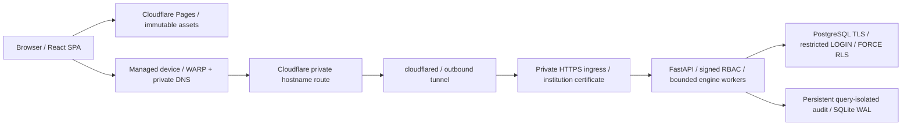

# SentinelSQL Cloudflare deployment runbook

Repository: [SentinelSQL](https://github.com/rahmahussen562-bot/-Enterprise-multi-agent-text-to-sql-platform). Frontend project: `sentinelsql-portal`. Stable frontend: `https://sentinelsql-portal.pages.dev`. Requested private API: `https://api.sentinelsql.internal`.

## Implemented topology



The `.internal` hostname requires managed clients, Gateway DNS/WARP hostname routing, and a trusted origin certificate. It cannot be treated as a public Pages-accessible API hostname with a public Cloudflare certificate. For a public buyer-facing application, set the API/WS variables to a real hostname in a Cloudflare-managed public DNS zone. [Cloudflare private hostname routing](https://developers.cloudflare.com/cloudflare-one/networks/connectors/cloudflare-tunnel/private-net/cloudflared/connect-private-hostname/).

Public alternative: Pages browser -> Cloudflare WAF/optional Worker -> Access-protected origin hostname -> Tunnel -> `http://fastapi:8000` -> TLS PostgreSQL. No origin host ports are published. The optional Worker is in `deploy_bundle/edge/`; it uses an HTTPS public origin and requires an Access service token to prevent direct gateway bypass.

PostgreSQL queries stay in Python. Each API identity owns a distinct restricted database LOGIN, preserving `session_user` RLS. Hyperdrive is not inserted into this reverse-proxy path; psycopg owns bounded origin-side pools. Edge caching accelerates static assets. Authenticated financial results and telemetry use `no-store`.

## Storage and host prerequisites

Use Linux containers. This Windows host has no Docker engine or configured WSL installation; neither was installed during this work. Use a Linux Docker runner, a remote engine, or preprovision Docker Desktop with its installation, disk image, build cache, and writable data on D:. Docker Desktop disk image location must be selected before building. [Docker Desktop storage settings](https://docs.docker.com/desktop/settings-and-maintenance/settings/).

On Windows, all project paths are under `D:\BIRD-Interact\`. Place a self-hosted GitHub runner and its `_work`, `_temp`, tool cache and Docker credential configuration there too. On Linux, use dedicated persistent directories such as `/srv/sentinelsql/data` and `/srv/sentinelsql/secrets`. Run the runner as a service with access to Linux Docker and Python. The workflow uses Bash; Windows runners require Git Bash. Use a current runner supporting Node 24 actions.

Never mount the same API state directory into multiple live API containers: the durable audit store has an exclusive process lease. Uvicorn uses one process with four bounded engine threads by default. Compose waits up to 40 seconds for termination; the API propagates cancellation and closes database work before shutdown. PostgreSQL is configured for 40 connections. Back up database and audit storage independently before host changes.

## Provision private files

Copy `.env.production.example` to a private `.env.production`; replace the release digest and storage paths. Values in this environment file are identifiers/settings, not credentials. All `VITE_*` settings are public and compiled into the SPA.

The directory named by `SECRETS_DIR` must contain:

| File | Purpose |
| --- | --- |
| `session.key` | At least 32 random binary bytes; maintain across releases |
| `accounts.json` | Nonempty account list: `user_id`, banking `role`, PBKDF2 `password_hash` |
| `postgres-identities.json` | Map each API ID to exactly `role`, `db_login`, `conninfo` |
| `postgres-password` | Random PostgreSQL administrator password; API never mounts this |
| `postgres-ca.crt` | Trusted CA for PostgreSQL clients |
| `postgres-server.crt` | Server certificate including DNS SAN `fincore_postgres` |
| `postgres-server.key` | Corresponding private server key |
| `tunnel-token` | Cloudflare remotely managed Tunnel token |
| `private-ingress.crt` | Private profile only: certificate SAN `api.sentinelsql.internal` |
| `private-ingress.key` | Private profile only: corresponding key |

Banking role choices are `branch_analyst`, `compliance_officer`, and `fraud_investigator`. Authorizations are server-owned. Database LOGINs require `NOSUPERUSER NOBYPASSRLS NOCREATEDB NOCREATEROLE`, membership in exactly one matching FinCore group, and an enabled `security.principals` record. Branch/case assignments are inserted by administrators. Do not copy synthetic CI accounts into production. Legacy T-SQL fixtures remain tested; the lean banking image does not provision Microsoft's SQL Server ODBC driver.

Account format:

```json
[{"user_id":"CORPORATE_ID","role":"branch_analyst","password_hash":"PBKDF2_HASH_FROM_PRIVATE_PROVISIONING"}]
```

PostgreSQL identity format:

```json
{"CORPORATE_ID":{"role":"branch_analyst","db_login":"RESTRICTED_LOGIN","conninfo":"host=fincore_postgres dbname=fincore user=RESTRICTED_LOGIN password=PRIVATE_VALUE sslmode=verify-full sslrootcert=/run/secrets/postgres-ca.crt"}}
```

These are structural examples, not usable accounts. Generate passwords privately, hash API passwords with `core.auth.password_hash`, and load the PostgreSQL LOGIN password from the institution's secret manager. The existing `tools/bootstrap_api.py --roles branch_analyst compliance_officer fraud_investigator` provisions keys and password hashes interactively into `.runtime/api-private` on D: without printing passwords. It refuses to overwrite an account directory.

On Linux, private directories should be `0750` or stricter. API and tunnel files must be readable by UID/GID 10001, e.g. owner root, group 10001, mode `0640`; public CA/certificates can be `0644`. `postgres-server.key` can remain root-owned `0600`: the PostgreSQL entrypoint copies it into a tmpfs with PostgreSQL ownership and mode `0600`. This also handles Windows bind-mount permission differences. API data must be owned by UID/GID 10001. Configure equivalent restrictive ACLs on D: for Windows. Compose secret files are bind mounts; `uid`/`gid` declarations do not repair host ownership. [Compose secrets](https://docs.docker.com/compose/how-tos/use-secrets/).

Use institutional PKI for production. The container smoke tool creates its own short-lived CA only for isolated CI fixtures. Never disable `sslmode=verify-full` or use `curl -k` to make a deployment check pass.

## First database initialization

The production stack does not automatically seed data or destructively reset a schema. Prepare private files and `.env.production`, then start PostgreSQL:

```powershell
Set-Location D:\BIRD-Interact\deploy_bundle
$env:DOCKER_CONFIG = 'D:\BIRD-Interact\deploy_bundle\.runtime\docker-config'
$env:FASTAPI_IMAGE = 'sentinelsql-api:local'
docker build --tag sentinelsql-api:local .
docker compose --env-file .env.production config --quiet
docker compose --env-file .env.production up --detach --wait fincore_postgres
```

On a Linux runner, run the equivalent commands from the repository's `deploy_bundle` directory and use Linux paths. BuildKit's cache lives in the Docker daemon's data storage; setting shell `TEMP` alone does not move it. The base Python, PostgreSQL and cloudflared images and all GitHub actions are pinned to verified digests/commits. The optional private ingress image setting should also be pinned to an institution-approved digest before production.

Create an administrator conninfo file privately at `SECRETS_DIR/admin.conninfo` using host `fincore_postgres`, `sslmode=verify-full`, and CA path `/run/secrets/postgres-ca.crt`. Apply migration 0001 once to a **fresh dedicated database**:

```powershell
docker compose --env-file .env.production run --rm --no-deps --user 0:0 --entrypoint python --env SENTINEL_PG_MIGRATION_DSN_FILE=/migration/admin.conninfo --volume D:/BIRD-Interact/deploy_bundle/.runtime/production/secrets/admin.conninfo:/migration/admin.conninfo:ro fastapi tools/migrate_fincore.py --apply
```

For an installed schema, use `--check`. The migration checks PostgreSQL 17+, 17 FORCE RLS tables, 12 invoker/barrier views and four restricted groups. Provision real API/database identities and branch/case assignments through private administrator tooling. Remove the administrator conninfo file from runtime access after initialization; it is not a normal API secret mount. Runtime releases check every restricted identity's schema and refuse a broken database configuration.

## Tunnel and private hostname configuration

Create a remotely managed Tunnel in the supplied Cloudflare account and place its token in the private file. The connector uses `--token-file`, keeping credentials out of command arguments. [Cloudflare token file parameter](https://developers.cloudflare.com/cloudflare-one/networks/connectors/cloudflare-tunnel/configure-tunnels/run-parameters/).

For the supplied `.internal` domain:

1. Enable `COMPOSE_PROFILES=edge,private` in the production environment.
2. Provision private ingress certificate/key; trust its CA on managed browsers and on the release runner.
3. Configure a Cloudflare private hostname route for `api.sentinelsql.internal` to this Tunnel. Its origin hostname resolves through the Docker `origin` network alias to `private_ingress`, HTTPS port 443.
4. Enroll client devices in WARP, enable Gateway DNS and the hostname routing feature, and configure the required routes/split-tunnel settings documented by Cloudflare.
5. Require the institution's device/user access policy. Private routing does not automatically apply a public-zone WAF ruleset.

For a public API, set `COMPOSE_PROFILES=edge`, configure a published Tunnel hostname in your public Cloudflare DNS zone, and map it to `http://fastapi:8000`. Update `API_ORIGIN`, `VITE_API_BASE_URL`, `VITE_WS_BASE_URL` and frontend build settings together. Apply WAF managed rules, automatic DDoS protection, API cache bypass, and IP/login rate policies for the real zone. `edge/security-policy.json` documents the settings; it does not claim to activate them through an unavailable account.

Start the origin and connector:

```powershell
docker compose --env-file .env.production --profile edge --profile private up --detach --no-build --wait
docker compose --env-file .env.production ps
docker compose --env-file .env.production exec -T fastapi python tools/container_health.py
$env:API_ORIGIN = 'https://api.sentinelsql.internal'
$env:SENTINEL_EDGE_CA_FILE = 'D:\BIRD-Interact\deploy_bundle\.runtime\production\secrets\private-ca.crt'
.venv\Scripts\python.exe tools\verify_edge.py
```

Public mode omits `--profile private` and `SENTINEL_EDGE_CA_FILE` when the system trust store recognizes the certificate. `/health` proves ASGI/AST liveness; the release script separately reads restricted database metadata and probes the connector `/ready`. A healthy connector alone does not prove client DNS/certificate setup.

## Optional Worker API gateway

Use this for a public Cloudflare zone. Set `edge/wrangler.toml` route/zone and `ORIGIN_URL` to a distinct published Tunnel hostname. Create an Access application on that origin that accepts only the Worker's service token; otherwise callers could bypass the Worker's rate controls. Allow the exact frontend origin.

Store `SESSION_KEY_B64`, `ACCESS_CLIENT_ID`, and `ACCESS_CLIENT_SECRET` as **Worker secrets**. `SESSION_KEY_B64` must encode exactly the raw bytes in the API's `session.key`; do not base64-encode a textual environment secret differently. Set `SESSION_TTL` to the API's session TTL. Choose account-unique rate namespace IDs. No key belongs in a Vite variable or TOML.

The Worker verifies HS256 and the five typed claims for protected HTTP routes. The API independently rechecks signatures, directory revocation and server entitlements. Browser WebSocket authentication stays in the first frame at FastAPI; the Worker applies origin/IP admission and returns the upgrade unchanged. JWTs never enter URLs. Tests cover forged/expired tokens, hostile origins, rate limits, origin credential replacement, CORS and abort linkage.

Worker rate bindings are per location and eventually consistent, so they supplement the API/database workload limits. [Worker rate limiting semantics](https://developers.cloudflare.com/workers/runtime-apis/bindings/rate-limit/).

With credentials already supplied through protected environment configuration, the pinned local CLI wrapper keeps caches/logs/configuration on D:. Worker secret commands prompt securely for values:

```powershell
Set-Location D:\BIRD-Interact\deploy_bundle
.venv\Scripts\python.exe tools\run_cloudflare.py secret put SESSION_KEY_B64 --config D:/BIRD-Interact/deploy_bundle/edge/wrangler.toml
.venv\Scripts\python.exe tools\run_cloudflare.py secret put ACCESS_CLIENT_ID --config D:/BIRD-Interact/deploy_bundle/edge/wrangler.toml
.venv\Scripts\python.exe tools\run_cloudflare.py secret put ACCESS_CLIENT_SECRET --config D:/BIRD-Interact/deploy_bundle/edge/wrangler.toml
.venv\Scripts\python.exe tools\run_cloudflare.py deploy --config D:/BIRD-Interact/deploy_bundle/edge/wrangler.toml --dry-run --outdir D:/BIRD-Interact/frontend/.runtime/worker-build
.venv\Scripts\python.exe tools\run_cloudflare.py deploy --config D:/BIRD-Interact/deploy_bundle/edge/wrangler.toml
```

Live Worker deployment is optional and requires a configured public route; the default CI release uses the requested Tunnel topology.

## Pages build and release

Copy `frontend/.env.production.example` to a private `frontend/.env.production`, then use the D: Node runtime:

```powershell
Set-Location D:\BIRD-Interact\frontend
$env:Path = 'D:\BIRD-Interact\frontend\.runtime\node;' + $env:Path
npm ci
npm test
npm run build
```

Build output is `frontend/dist`. The Vite plugin emits `_headers` with exact HTTPS/WSS connection origins, HSTS, denied embedding, no referrer and restricted permissions. No wildcard external connection origins are allowed. Scripts, fonts and charts are local. Voice input is disabled unless explicitly enabled for local development; Pages denies microphone access. Hashed assets cache immutably; HTML can revalidate. `_redirects` supplies the SPA fallback. Pages header/redirect files apply to static assets, so a later Pages Functions API must set its own response headers. [Pages headers](https://developers.cloudflare.com/pages/configuration/headers/), [Pages redirects](https://developers.cloudflare.com/pages/configuration/redirects/).

If the Pages project does not exist, create it once using `tools/run_cloudflare.py pages project create sentinelsql-portal --production-branch=main` with the protected account credentials. The workflow uses `cloudflare/wrangler-action` with `pages deploy dist --project-name=sentinelsql-portal --branch=main`; it deploys the already-tested artifact after backend and live ingress checks pass. Local Pages CLI equivalent:

```powershell
Set-Location D:\BIRD-Interact\deploy_bundle
.venv\Scripts\python.exe tools\run_cloudflare.py pages deploy D:/BIRD-Interact/frontend/dist --project-name=sentinelsql-portal --branch=main
```

## GitHub Actions configuration

The workflow is at repository root `.github/workflows/deploy.yml`, because `frontend/` and `deploy_bundle/` are siblings.

Set production GitHub Secrets:

- `CLOUDFLARE_API_TOKEN`: scoped Pages edit permission for the intended account.
- `CLOUDFLARE_ACCOUNT_ID`: the supplied account identifier, kept in Secrets as requested.
- `TUNNEL_TOKEN`: the remotely managed connector token.

Set `VITE_API_BASE_URL` and `VITE_WS_BASE_URL` as **repository Variables** so the frontend build gate can read them without production secrets or an environment approval. Other values can be production environment Variables:

- `VITE_API_BASE_URL` and `VITE_WS_BASE_URL`: public build settings; defaults use the supplied private hostname.
- `API_ORIGIN`: HTTPS ingress used by the release probe.
- `SENTINEL_DEPLOY_DIR`: preprovisioned persistent release directory on the runner.
- `SENTINEL_SECRETS_DIR`: matching private file directory.
- `SENTINEL_EDGE_CA_FILE`: private ingress CA file, when required.

Add the runner label `sentinelsql-production`. Restrict runner access to trusted production jobs and the protected main branch. The workflow sends PR tests to disposable hosted runners and only dispatches deployment after main-branch gates pass. Backend account/password files, signing key and PKI remain on the host; they are never built into the image. GHCR publishing/pulling uses scoped `GITHUB_TOKEN`. The runner's private `.env.production` and persistent secret files must exist before its first release.

Release order: full backend tests against native PostgreSQL -> frontend audit/tests/build -> real TLS Compose image smoke -> GHCR digest publication -> self-hosted backend update, database/connector/HTTPS probes -> Pages artifact deployment. Failed backend checks attempt to restore the prior API digest without removing PostgreSQL or audit data. First deployment has no previous digest. Releases serialize rather than cancelling an in-progress production update. Query cancellation during container replacement follows the API's graceful shutdown hooks; zero-downtime multi-replica rollout requires a future shared job/audit store.

## Local verification and current limits

```powershell
Set-Location D:\BIRD-Interact\deploy_bundle
.venv\Scripts\python.exe -m pip check
.venv\Scripts\python.exe tools\run_phase01_tests.py -q --junitxml=docs/PHASE56_TEST_RESULTS.xml
.venv\Scripts\python.exe tools\check_phase56_frontend.py
.venv\Scripts\python.exe tools\verify_phase56_manifests.py
$env:FASTAPI_IMAGE = 'sentinelsql-api:ci'
docker build --tag sentinelsql-api:ci .
.venv\Scripts\python.exe tools\smoke_container.py
```

The smoke tool creates an owned isolated Compose project, temporary CA, random credentials and empty banking fixture, verifies TLS/RLS/masked metadata/clean zero-row execution, then stops the API and tears down its containers. It never reads production data or tokens. Native baseline tests still use the D: PostgreSQL fixture on Windows; Linux CI creates a separate native PostgreSQL container and tests the same schema, policies and ledger invariants without skipping them.

Local evidence: 326 backend tests, 20 frontend tests, 14 Worker/header tests; zero failures/skips; zero npm vulnerabilities; pip check, critical Python lint, API contract drift, production SPA build, and emoji scan passed. Docker build/live stack and actual Cloudflare release remain unverified on this host because Docker, account credentials and the production runner are unavailable. CI gates and commands above make those remaining checks explicit.
