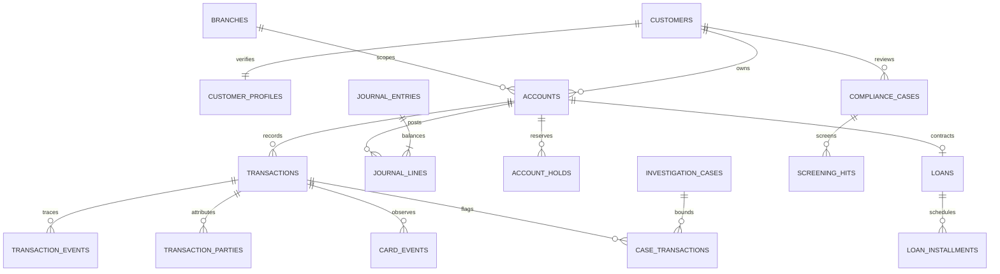

# FinCore Enterprise schema and operating contract

Migration `0001` targets **PostgreSQL 17+**. Financial definitions are versioned as
**1.0.0** in `data/financial_metrics.v1.json`. Banking sessions select the PostgreSQL
adapter; existing `sales_analyst` and `inventory_lead` sessions retain the legacy
SQLite/T-SQL engine. The browser cannot choose its database dialect or permissions.

## Relational model

UUIDs identify business records; amounts use `numeric(20,2)`, annual rates use
`numeric(10,8)`, scores use `numeric(5,2)`, dates use `date`, and event times use
`timestamptz`. USD, EUR and EGP are separate ISO currency buckets. No floating-point
money, implicit FX rate, or cached mutable account balance is used.

| Relation | Keys and governed fields | Invariants / relationships |
| --- | --- | --- |
| `fincore.currencies` | PK `code char(3)`; `minor_units` | USD/EUR/EGP; two minor units in v1 |
| `fincore.branches` | PK `branch_id`; unique `branch_code`; country | Branch assignment boundary |
| `fincore.customers` | PK `customer_id`; `encrypted_identifier bytea`, key reference, algorithm, jurisdiction, created time | Ciphertext only; AES-256-GCM or PGP-AES256 envelope format |
| `fincore.customer_profiles` | PK/FK `customer_id`; encrypted profile, key reference, KYC state/verified time, risk tier/score/assessment time | Verified KYC requires verification time; risk score 0–100 |
| `fincore.accounts` | PK `account_id`; customer/branch FKs; type, currency, normal side, status | Compound unique `(account_id,branch_id,currency)`; deposit accounts credit-normal, loan/settlement debit-normal |
| `fincore.transactions` | PK `transaction_id`; compound account FK; positive amount, direction, channel, business date, status, unique `reversal_of`, flagged | Cash/transfer/card/internal; in/out; pending/posted/rejected; currency and branch match account |
| `fincore.transaction_parties` | PK `(transaction_id,customer_id,party_role)` | Known conductor/beneficiary link; reporting deduplicates transaction/person |
| `fincore.transaction_events` | PK `event_id`; transaction FK; type/time; `evidence jsonb` | Structured object evidence; unavailable to analytics personas |
| `fincore.journal_entries` | PK `entry_id`; branch/currency/business date; draft/posted; optional transaction FK and unique reversal FK | Draft creation, explicit seal; posted header immutable |
| `fincore.journal_lines` | PK `(entry_id,line_no)`; compound header/account FKs; debit/credit | Positive exactly one side; no cross-branch/currency posting |
| `fincore.account_holds` | PK `hold_id`; account FK; amount, placed/expiry/release times | Positive amount; valid chronological lifecycle |
| `fincore.loans` | PK `loan_id`; unique account FK; annual rate, day-count convention, origination/maturity | Fixed simple-interest contracts; rate 0–1; maturity after origination |
| `fincore.loan_installments` | PK `(loan_id,installment_no)`; due date, scheduled/paid amount | Positive schedule; paid amount 0–scheduled |
| `fincore.compliance_cases` | PK `case_id`; customer FK; KYC/AML/SAR/CTR type, status, opened time, risk score, confidential JSONB | Confidential evidence has no analytics column grant |
| `fincore.screening_hits` | PK `hit_id`; customer/case FKs; list source, match score, disposition/time | Pending/confirmed/false-positive; score 0–100 |
| `fincore.investigation_cases` | PK `case_id`; active/closed, opened time, reason code | Fraud access ends when the case closes |
| `fincore.case_transactions` | PK `(case_id,transaction_id)` | Explicit investigation evidence scope |
| `fincore.card_events` | PK `event_id`; transaction FK; token UUID, event/time/outcome | Tokens only; no PAN, CVV or cardholder identity |
| `fincore.audit_logs` | Generated bigint PK; time, `actor=session_user`, action, object UUID, JSONB evidence | Posting audit committed atomically; UPDATE/DELETE rejected |
| `security.principals` | PK actual database LOGIN; persona, enabled | Private identity binding, never client-supplied context |
| `security.branch_assignments` | PK `(db_login,branch_id)` | Private assigned branches |
| `security.case_assignments` | PK `(db_login,case_id)` | Private assigned investigations |
| `fincore.institution_config` | Singleton; approved business timezone | Africa/Cairo initially; independent of browser/connection timezone |
| `fincore.schema_versions` | PK migration version; applied time | Migration ownership and upgrade boundary |



## Ledger lifecycle

A writer creates a draft header, inserts lines, then seals the header as posted
inside one transaction. Deferred constraint triggers require at least two lines
and exact debit/credit equality at commit. Failure rolls back the header, lines
and posting audit together. The line guard locks every affected header in a
deterministic order, serializing concurrent line changes and sealing. Posted
headers and lines cannot be edited or deleted. A reversal is a new posting linked
to the immutable original: same branch/currency, with each account's aggregate
debits and credits exactly swapped. Merely balancing a different amount is rejected.

The analytics API is read-only; privileged ingestion/posting belongs to a separate
writer service. This migration supplies accounting constraints and sample fixtures,
not a complete payment processor, card vault, or production loan-servicing system.
Operators must validate imported transaction-to-ledger reconciliation and approved
contract data before migration cutover. Chinook records are not transformed into
fictional banking customers or transactions.

## RBAC, RLS and masking

| Persona | Exclusive SQL allowlist | Row scope | Hidden information |
| --- | --- | --- | --- |
| `compliance_officer` | `compliance.kyc_reviews`, `aml_transactions`, `risk_assessments`, `compliance_cases`, `screening_hits`, `cash_daily_monitoring` | Enabled compliance principal; institution-wide review records | Encrypted identifiers/profiles, decryption keys/functions, private case evidence, account ledger and fraud case views |
| `branch_analyst` | `branch.account_summaries`, `daily_flows`, `loan_performance` | Enabled principal's assigned branches only | Customer identity/link columns, KYC/SAR/CTR cases, individual raw transactions, fraud cases |
| `fraud_investigator` | `fraud.flagged_transactions`, `card_events`, `investigation_cases` | Flagged transactions and card events linked to assigned **active** cases | Customer PII, compliance case material, unflagged/unassigned activity, ordinary branch balances |

The allowlists have no overlapping relation names. Exact allowed columns are
reviewed in `core/fincore.py`; the schema endpoint intersects these contracts with
actual database column privileges. Branch summaries expose account UUIDs and loan
UUIDs without customer links; these remain access-controlled pseudonymous records.
Schema metadata returns no invented foreign keys for PostgreSQL views.

All 17 sensitive base tables have **ENABLE + FORCE RLS** with default-deny behavior.
Analytics views use `security_invoker=true` and `security_barrier=true`, plus
explicit underlying column grants. Native column grants independently deny PII
and confidential evidence even when raw SQL bypasses the application. PostgreSQL
documents the [RLS owner/bypass rules](https://www.postgresql.org/docs/current/ddl-rowsecurity.html)
and [invoker view semantics](https://www.postgresql.org/docs/current/sql-createview.html).

Invoker views require grants on the underlying columns they read. Consequently,
the database LOGIN can read those granted, row-scoped base columns outside the
gateway; view-only query access is also enforced by the AST allowlist. Branch
aggregation and exclusion of raw transaction queries are gateway restrictions;
database RLS independently enforces assigned branches and native column grants
exclude customer linkage and PII. These layers have distinct responsibilities.

Each API identity authenticates as its own PostgreSQL LOGIN, inheriting exactly
one NOLOGIN group: `fincore_compliance`, `fincore_branch`, or `fincore_fraud`.
The adapter refuses superusers, BYPASSRLS, CREATEDB/CREATEROLE, owner membership,
wrong persona and multiple persona memberships. ACL helpers use **session_user**
and private assignment tables, with SECURITY DEFINER and a fixed `pg_catalog`
search path. `SET ROLE`, client-selected branches, and `set_config()` cannot
replace the authenticated principal. Disabled principals and closed cases lose
rows even on an existing pooled connection.

`fincore_owner` is NOLOGIN with an explicit internal maintenance policy; application
LOGINs never inherit it. Migrations use separate administrator credentials. Superusers
and the authorized maintenance owner remain privileged and require operational
separation; RLS does not constrain a database superuser. Ciphertext/key-reference
storage and actual encrypted fixtures are implemented; production envelope keys
must be supplied by the institution's KMS/writer service, outside analytics.

## PostgreSQL AST and execution boundary

The Guardian parses and renders with SQLGlot's `postgres` dialect. Physical tables
in nested queries, CTEs, joins and correlated subqueries must match an explicitly
schema-qualified authorized view. PostgreSQL quoted identifiers keep their case
semantics. CTE/output aliases are resolved in query scope; masked or invented
columns fail before driver execution. `SELECT *` is refused under banking masking
policy; `COUNT(*)` remains valid. Unknown parser state fails with `AST_PARSER_FAILURE`.
Mutation, locking, stacked statements and unsupported functions are rejected;
pagination uses `LIMIT`, preserving legacy T-SQL `TOP` behavior on legacy roles.

`core/postgres.py` uses Psycopg 3 async connections and `AsyncConnectionPool`:
default pool maximum 2, waiting queue 4, acquisition timeout 2 seconds, statement
timeout 5 seconds and result limit 1,000 rows. Every query uses a read-only
transaction with PostgreSQL statement/lock/transaction timeouts. Overflow is
rejected rather than silently truncated.
Schema catalog reads have a separate 64-column budget, so reducing the query
result limit to one row cannot prevent complete authorized schema validation.
Cancellation uses the driver protocol
and rolls back before lease reuse. The Phase 2 cancellation token connects HTTP/
WebSocket cancellation to the native connection. Psycopg documents
[async cancellation and Windows selector loops](https://www.psycopg.org/psycopg3/docs/advanced/async.html),
[cancel_safe](https://www.psycopg.org/psycopg3/docs/api/connections.html) and
[bounded pooling](https://www.psycopg.org/psycopg3/docs/api/pool.html).

The synchronous agent controller runs on its existing worker thread through a
bridge owning an async pool and event loop for that controller scope. This keeps
the ASGI loop responsive and retains the approved state machine. Pools are
bounded per controller; existing API worker admission bounds one process.
Multi-replica admission and a shared job/audit store remain deployment work.
Remote database connections require `sslmode=verify-full`; loopback fixtures use
SCRAM authentication without a production TLS claim.

## Financial definitions and supported questions

- **Daily balance:** ledger postings through `fincore.business_date()` with debit/
  credit orientation from `accounts.normal_side`. Active holds are placed before
  statement time, not yet expired or released. Available balance subtracts holds.
  `business_date_at()` uses the institution timezone, independent of connection
  UTC or browser locale. Historical/as-of filtering is not synthesized in v1.
- **High-risk cash:** distinct transaction/person records, known conductor or
  beneficiary, posted USD cash only, grouped across accounts by business date.
  Cash-in and cash-out are separate totals and either must **exceed**, not equal,
  USD 10,000. No netting. This is US reference monitoring based on
  [FinCEN's CTR FAQ](https://www.fincen.gov/resources/frequently-asked-questions-regarding-fincen-currency-transaction-report-ctr),
  without exemptions, inferred ownership, automatic filing or EUR/EGP conversion.
- **Loan performance:** ledger principal; overdue days since the earliest unpaid
  installment; daily fixed simple interest using contractual ACT/360, ACT/365F or
  30E/360. Decimal precision is retained until currency posting. No inferred grace
  periods, compounding, variable rates, or unregistered day-count conventions.

Banking coder v1 uses a finite reviewed request catalog, without external model
synthesis or media formulas. Accepted examples:

| Persona | Approved English requests |
| --- | --- |
| Branch | `Show daily account balances`, `Show daily balances`, `Show available balances`, `Show branch daily flows`, `Show loan performance`, `Show loan delinquency and interest accrual` |
| Compliance | `Show KYC reviews`, `Show risk assessments`, `Show AML compliance cases`, `Show compliance cases`, `Show screening hits`, `Show high-risk cash monitoring`, `Show cash monitoring` |
| Fraud | `Show flagged transactions`, `Show card events`, `Show active investigation cases` |

Unknown questions, added filters/dates/currencies, and cross-persona metrics fail
closed. Empty authorized results succeed without regeneration or weakened filters.
The frontend labels banking dialects, exposes these shortcuts, and retains English
technical prompts inside the Arabic RTL layout. Broader multilingual NL synthesis
needs approved parameter grounding and metric constraints in a subsequent change.

## Provision and run on D:

1. Use the existing D-drive virtual environment. Install additive driver dependencies
   and the isolated native verification runtime if not already present:

   ```powershell
   Set-Location D:\BIRD-Interact\deploy_bundle
   . .\tools\use_d_runtime.ps1
   .\.venv\Scripts\python.exe -B tools\install_phase04.py
   ```

2. Create a fresh dedicated PostgreSQL 17+ database with a privileged operator
   identity. Save its conninfo in an ACL-restricted **D:** file; never commit it or
   pass its password in command-line arguments. Set the migration file path:

   ```powershell
   $env:SENTINEL_PG_MIGRATION_DSN_FILE = 'D:\BIRD-Interact\deploy_bundle\.runtime\api-private\migration.conninfo'
   .\.venv\Scripts\python.exe -B tools\migrate_fincore.py --apply
   .\.venv\Scripts\python.exe -B tools\migrate_fincore.py --check
   ```

   The apply command refuses existing application relations; it never drops data.
   Configure the institutional business timezone before importing business dates.
   Import approved encrypted profiles, accounts, contracts and balanced postings
   through an institution-controlled writer rather than using synthetic test data.

3. Provision one restricted PostgreSQL LOGIN per API identity using SCRAM secrets
   supplied privately, grant exactly its persona group, then insert the matching
   `security.principals` row and approved branch/case assignments. No public demo
   username/password is supplied. Provision private API password hashes using
   `tools/bootstrap_api.py --roles branch_analyst compliance_officer fraud_investigator`
   on first setup. For an existing account directory, add approved password-hash
   records explicitly; the bootstrap command refuses to overwrite existing users.

4. Save a private identity directory in D: and set `SENTINEL_PG_AUTH_FILE`:

   ```json
   {
     "institution_api_identity": {
       "role": "branch_analyst",
       "db_login": "unique_restricted_database_login",
       "conninfo": "<private conninfo; remote connections require sslmode=verify-full>"
     }
   }
   ```

   The key must match the server API account identity; the role must match its
   signed, server-issued role. This file carries secrets and needs restricted OS
   permissions. The adapter rejects shared LOGINs across different API identities.

   ```powershell
   $env:SENTINEL_PG_AUTH_FILE = 'D:\BIRD-Interact\deploy_bundle\.runtime\api-private\postgres-identities.json'
   .\.venv\Scripts\python.exe -B tools\run_api.py
   ```

5. Start the existing SPA from `D:\BIRD-Interact\frontend` with its D-drive runtime
   script, then `npm run dev`. Sign in using the provisioned banking account. The
   server returns only its authorized FinCore schema and selects PostgreSQL.

## Reproduce verification

```powershell
.\.venv\Scripts\python.exe -B tools\run_phase01_tests.py tests -q `
  --basetemp=D:/BIRD-Interact/deploy_bundle/.runtime/phase04-tests `
  --junitxml=docs/PHASE04_TEST_RESULTS.xml
```

`tests/test_fincore.py` starts actual PostgreSQL 17.11 on loopback, creates an
isolated database and six restricted identities, encrypts synthetic records and
posts a balanced ledger. It drops only that owned test database/identities and
stops the fixture server on exit. Its native binaries, cluster, SCRAM secrets,
temporary files and synthetic data remain under D:. Test secrets are redacted
from fixture representations and rotated each run. This provides native RLS,
constraint and cancellation evidence, not a mock-only PostgreSQL assertion.
The fixture is Windows-specific; Linux CI should run an equivalent PostgreSQL
17 service and retain these same native tests before the container rollout.
